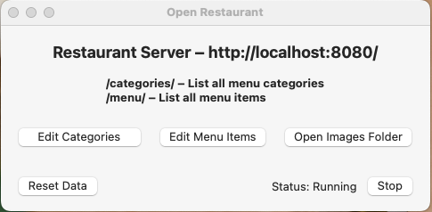

# OrderApp
<kbd></kbd> <kbd></kbd> <kbd></kbd> <kbd></kbd>

OrderApp is a simple food ordering app used by restaurants to track customers order and receive estimated preparation time.

## Description

An iOS application that allows employees to navigate a restaurant’s menu with ease and add desired food items to customers’ orders. Employees can switch between tabs that display the menu and a list of items of the current order. Once an order is submitted, the employee is given a confirmation of the customer’s total price and estimated preparation time. This app utilizes information from a local server API and translates information into user friendly interfaces on their personal device

## Getting Started

- Make sure you have the Xcode version 14.0 or above installed on your computer

- Download the OrderApp project files from the repository

- Open the project files in Xcode

- Review code and make sure you understand what it does

- Run active scheme

You should see the application run on simulated device or hardware device of your choosing. Navigating between controllers should be fairly easy. If you have any issues or need help, feel free to contact me for assistance.

## Usage
Please be sure to open the “Open Restaurant” file separately from project. An advised way is to navigate to file through Finder on MacOS or File Explorer on Windows, then open file.

<kbd></kbd>

- You must start the local server before running application to avoid displaying error.
- Edit Categories / Edit Menu Items button allows you to edit the restaurants menu and categories to your liking.
- The Open Images Folder button nests the images for menu items.
<h4>Note: Images are named by their id tag following the PNG extension. To browse id tags, open Edit Menu Items button to explore information in relation to each menu item.</h4>

## Contributing

Pull requests are welcome. For major changes, please open an issue first
to discuss what you would like to change.

Please make sure to update tests as appropriate.

## License

[MIT](https://choosealicense.com/licenses/mit/)
